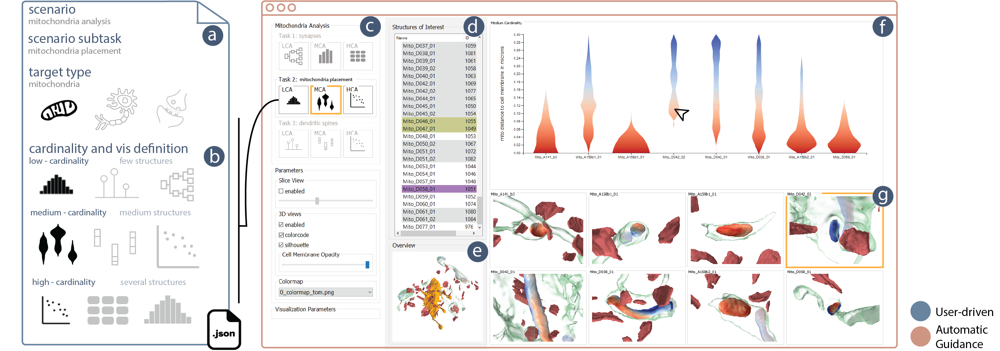

<h1 align="center">
  Barrio
</h1>

  
  **A Visual Tool to Compare and Analyze Nanoscale Brain Structures.**
  

  
  
  

## Abstract
High-resolution electron microscopy imaging allows neuroscientists to reconstruct not just entire cells but individual cell substructures (i.e., cell organelles) as well. Based on these data, scientists hope to get a better understanding of brain function and development through detailed analysis of local organelle neighborhoods. In-depth analyses require efficient and scalable comparison of a varying number of cell organelles, ranging from two to hundreds of local spatial neighborhoods. Scientists need to be able to analyze the 3D morphologies of organelles, their spatial distributions and distances, and their spatial correlations. We have designed Barrio as a configurable framework that scientists can adjust to their preferred workflow, visualizations, and supported user interactions for their specific tasks and domain questions. Furthermore, Barrio provides a scalable comparative visualization approach for spatial neighborhoods that automatically adjusts visualizations based on the number of structures to be compared. Barrio supports small multiples of spatial 3D views as well as abstract quantitative views, and arranges them in linked and juxtaposed views. To adapt to new domain-specific analysis scenarios, we allow the definition of individualized visualizations and their parameters for each analysis session. We present an in-depth case study for mitochondria analysis in neuronal tissue and demonstrate the usefulness of Barrio in a qualitative user study with neuroscientists.

## Installation
Checkout this [page](https://github.com/jakobtroidl/Barrio/wiki/Getting-Started).

## Datasets
Please reach out via [e-mail](mailto:jtroidl@g.harvard.edu) if you are interested in the datasets.

## FAQs
Check out the FAQs for further development and more [here](https://github.com/jakobtroidl/NeuroKit/wiki/FAQs). 

